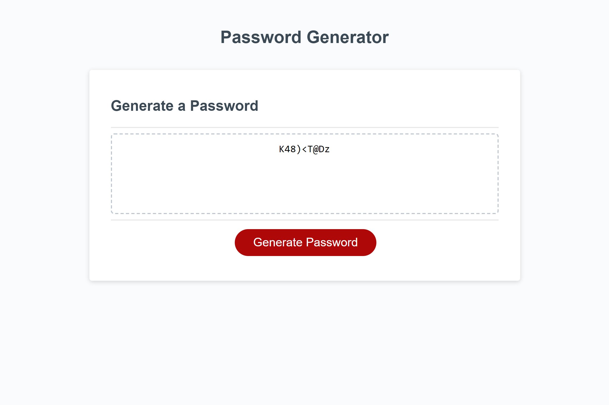

# Password Generator
## Description
This application takes prompts the user for criteria to generate a secure password. The application itself can be found [here](https://aaron-heath.github.io/password-generator/). The application uses JavaScript to prompt the user with browser prompts, confirms, and alerts to decide how they want their password to be generated.

The application will validate user input to ensure that it conforms to the variable types and parameters outlined in the prompts provided to the user.

See the a screenshot below:

## Installation

N/A

## Usage

Press the 'Generate Password' button to begin the prompts. The password length must be between 8 and 128 characters. If the user enters a length outside of those parameters or enters something other than a number, they will be prompted that the input is invalid. If the user selects no criteria, they will be prompted to criteria were selected and the function will return.

## Credits

N/A